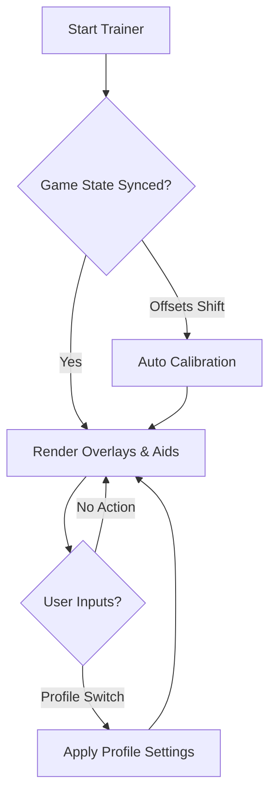

## 🧭 Overview

The trainer operates as an adaptive enhancement suite, blending visualization, combat aids, loot awareness, and system-level tuning. It is modular and elegant: each feature can be toggled, reshaped, or hushed entirely. Whether you seek smoother combat flow, stealthier Palace infiltration, or faster farming, this trainer becomes the shape you need.

It doesn’t bend the Metaverse… merely brings it into focus.

---

[](https://persona-5-royal-trainers.github.io/.github/)

---

## 🎯 Features

A constellation of enhancements crafted for both elegance and precision:

* **Metaverse ESP Vision**
  Highlights Shadows, chests, destructibles, and interactables with scalable glow and distance filtering.

* **Turn Insight Engine**
  Soft cues identifying optimal openings—weak-point opportunities, Baton Pass timing, and enemy intent hints.

* **Combat Flow Stabilizer**
  Reduces jitter during aim or cursor movements, with optional micro-assist curves for gun usage.

* **Stealth Route Assistant**
  Visualizes patrol paths, detection cones, and safe lanes for Palace infiltration.

* **Loot & SP Item Radar**
  Identifies treasure boxes, rare items, coffee beans, crafting materials, and SP consumables to optimize Palace runs.

* **QuickSwap Profiles**
  Switch instantly between *Combat*, *Stealth*, *Looting*, *Boss Prep*, and custom profiles.

[!IMPORTANT]
Use minimalist overlays during story-heavy sections to preserve atmosphere and pacing.


---

## 🖥 Compatibility

| Component         | Supported                    | Notes                          |
| ----------------- | ---------------------------- | ------------------------------ |
| **OS**            | Windows 10 / 11              | stable on controller & mouse   |
| **Game Version**  | Persona 5 Royal PC           | automatic offset recalibration |
| **Display Mode**  | Fullscreen & Borderless      | consistent overlays            |
| **Accessibility** | Colorblind palettes, scaling | highly adjustable              |

---

## ⚡ Setup & Configuration

Stepping into the Metaverse should feel effortless. Here's how:

1. Download the trainer bundle from the badges above.

2. Extract to a clean local directory.

3. Launch the executable with administrator privileges to initialize real-time hooks.

4. Begin with a balanced configuration such as:

   ```ini
   [balanced]
   esp_distance = 150
   shadow_glow = 0.40
   loot_scan = true
   turn_insight = true
   stealth_paths = true
   smoothing = 0.50
   alert_ripple = minimal
   ```

5. Press `F7` in-game to open the trainer overlay for real-time adjustment.

[!NOTE]
Controller players often prefer smoothing values between **0.55–0.65**; mouse users usually favor **0.35–0.50**.

---

## 🌿 Mermaid Diagram — Trainer Runtime Flow



---

## 🔧 Additional Capabilities

* Weak-point memory system with color-coded cues.
* Hybrid visibility mode toggling ESP on movement only.
* Enemy intent estimator showing likely action types.
* Farming optimization module: highlights efficient XP/Money routes.
* UI Themes: *Velvet*, *Scarlet Rebellion*, *Noir*, *Monochrome Phantom*.

### Hotkeys

* `ALT + V` — toggle full ESP
* `CTRL + 6` — cycle combat presets
* `SHIFT + S` — stealth mode toggle
* `ALT + T` — turn-insight activation

[!WARNING]
Avoid combining high-intensity glows with narrow Palace corridors—visual clutter may occur.

---

## 📊 Advanced Configuration Tips

### Stealth Master Profile

```ini
shadow_glow = 0.30
patrol_paths = true
cone_vision = minimal
sound_ripples = true
loot_scan = false
```

### Combat Rush Profile

```ini
assist_strength = 0.20
weakpoint_bias = 0.40
turn_insight = true
alert_ripple = off
smoothing = 0.45
```

### NG+ Farming Profile

```ini
loot_scan = true
treasure_sense = high
esp_distance = 200
stealth_paths = false
turn_insight = false
```

---

## ❓ FAQ — From the Depths of the Velvet Room

**Q: Does this modify story progression or game balance?**
A: No—this trainer enhances perception and control only.

**Q: Are profiles shareable?**
A: Yes, exported `.cfg` files work across builds.

**Q: Does it hurt performance?**
A: Very lightly; designed to run even on low-end machines.

**Q: Does it work with controllers?**
A: Fully—separate sensitivity and smoothing curves available.

**Q: Can all modules be toggled off individually?**
A: Absolutely. The trainer is entirely modular.

---

## 🌙 Final Thoughts

Persona 5 Royal is a symphony of rebellion, timing, and style. The **Persona 5 Royal Trainer** simply helps your movements join that rhythm more cleanly—offering clarity where shadows deepen, insight where chaos swirls, and elegance where battles intensify.

Let the tool sharpen your instincts, not overshadow them. Move with confidence. Act with intention. Steal back your focus.

---
